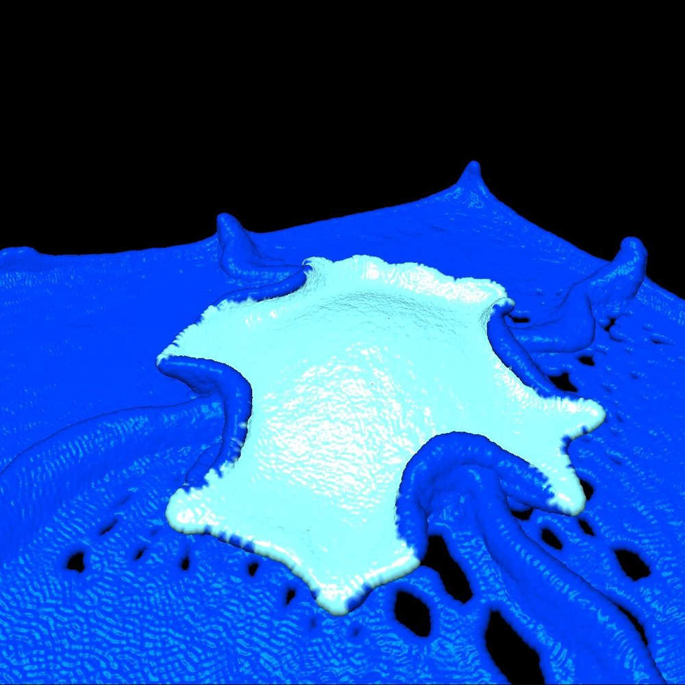

Incredibly unpolished implementation of a fluid sim based on this paper: [Particle-based viscoelastic fluid simulation](http://dx.doi.org/10.1145/1073368.1073400)

Simulated using CUDA kernels and rendered with OpenGL.

